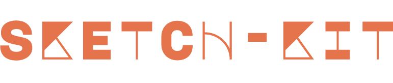

[](https://app.fossa.com/projects/git%2Bgithub.com%2Fk-may%2Fsketch-kit?ref=badge_shield)

[](https://badge.fury.io/js/sketch-kit)

[](https://app.fossa.com/projects/git%2Bgithub.com%2Fk-may%2Fsketch-kit?ref=badge_shield)


<!-- TABLE OF CONTENTS -->
<details>
  <summary>Table of Contents</summary>
  <ol>
    <li>
      <a href="#about-the-project">About The Project</a>
      <ul>
        <li><a href="#built-with">Built With</a></li>
      </ul>
    </li>
    <li><a href="#roadmap">Roadmap</a></li>
    <li><a href="#setup">Setup</a></li>
    <li><a href="#cli">CLI</a></li>
    <li><a href="#contact">Contact</a></li>
  </ol>
</details>

<!-- ABOUT THE PROJECT -->
## About The Project

Rapid prototyping framework for HTML5 projects

To help speed up the process of creating and running small experiments and prototypes I've developed some tools which I believe take much of the pain out of the experience.

The idea being; the more time one can spend on the fun bits (vs the boring dev-ops bits) the better and more expressive prototyping can be.

Sketch-Kit is designed to live along-side your project (a sketch-kit/ folder will exist in the project root), to provide a sand-box infrastructure where you can work through solutions. Sketch-Kit is ideal for :
- **Experimenting** with js libraries used in your project code
- **Nuancing transitions** (without having to navigate and potentially contaminate project code)
- **Sharing** code examples with your team
- Quick **iteration** on sketches
- Not being bound to a _safety-first_ developer mindset, encourage developers to have a little fun and **be expressive**!

### Built With

- [vite](https://vitejs.dev/) (HMR, development, building)
- [glslify](https://github.com/glslify/glslify)
- sass


## Roadmap

- [x] Migrate to [vite](https://vitejs.dev/) for HMR and build tools
- [ ] UI Improvements:
  - [x] Add fullscreen button
  - [ ] Add 'create sketch' button
- [ ] Console Improvements:
  - [ ] Tagging via 'create' statement
- [ ] Add support for [dat.gui](https://github.com/dataarts/dat.gui) to allow for easy control of sketch parameters

- [ ] Add support for [three.js](https://threejs.org/) to allow for easy 3D prototyping

- [ ] Add support for [p5.js](https://p5js.org/) to allow for easy 2D prototyping


## Setup

Each '_sketch_' gets a javascript file and scss file generated on creation.

When the sketch is selected from the menu (top left, very discrete) the js for the sketch is imported and attached to a dom element on the page. This element is exposed as `this.el`.

Each sketch exposes a interface for commonly used methods, the most important being '_draw_' : 

```js
    /**
     * All rendering should be placed here. Tick durations are clamped to 60fps
     * @param time : number
     * @param deltaTime : number
     */
    draw({time, deltaTime}) {
        //rendering goes here!
    }

```

## CLI
### Update

`sketch-kit update`

This is called by default by the following commands. Copies dependencies from package.json into the sketches folder.

**Note;** as of writing, most npm dependencies don't support es6 modules, to import deps into your sketch you'll most likely need to do something like the following to statically import them :

```
import '../../../node_modules/[library path]
```

### Init

`sketch-kit init`

This command will add a 'sketches' folder to the root of your directory. Inside you'll find :

```
sketches/
--------/assets
--------/css
--------/data
--------/js
--------/--------/main.js
--------/--------/sketches.js
--------/--------/utils
--------/--------/views
--------/--------/--------/components
--------/--------/--------/sketches
--------/node_modules (optional)
--------/scss
--------/--------/sketches
--------/index.html
--------/sketch-kit.config.json
```

**Options**

- Project Name. _Name for the project (basically becomes the title for the rendered page)._
- Copy Node Dependencies. _sketch-kit will automatically copy all dependencies from your project.json, making them available to your sketches (note: js modules only)._

### Run

`sketch-kit run`

sketch-kit will start up browser-sync and the watch tasks for your scss.


### Create

`sketch-kit create [sketch name] [copy name(optional)]`

sketch-kit will add a new sketch to your sketches and wil now be available in the menu. This sketch includes the base sketch view template and a scss file with the sketch name being used as the css class reference.

If the sketch already exists, you'll be prompted to copy or replace, creating a new nested iteration.

**Note;** give sketches unique names to ensure that there aren't conflicts when copying. The replace method will search through the code and indescriminately replace the sketch name with whatever the next sketch name will be


### Build

`sketch-kit build`

sketch-kit will create a `build/` folder containing a static build of the project.


### Global Options

~~_configFile_~~ NO LONGER SUPPORTED

Define an alternative config file for different distributions.

`sketch-kit run --configFile alt.config.json`

If the sketch already exists, you'll be prompted to copy or replace, creating a new nested iteration.

The base sketch-kit.config.json defines the sketches which are visible while running sketch-kit, and provides a target for adding new sketches.

## License
[](https://app.fossa.com/projects/git%2Bgithub.com%2Fk-may%2Fsketch-kit?ref=badge_large)


## Contact

Kevin May - [@kev_mayo](https://twitter.com/kev_mayo) / [email](mailto:kevmayo@gmail.com)
